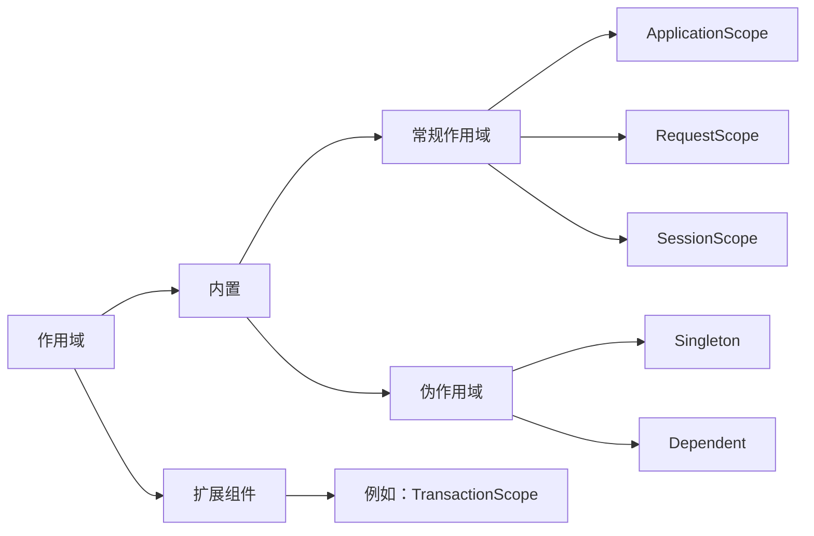
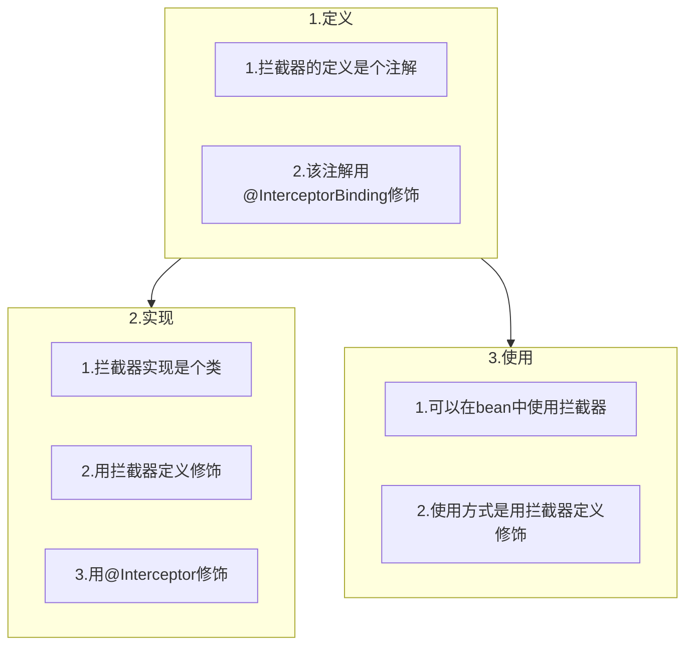
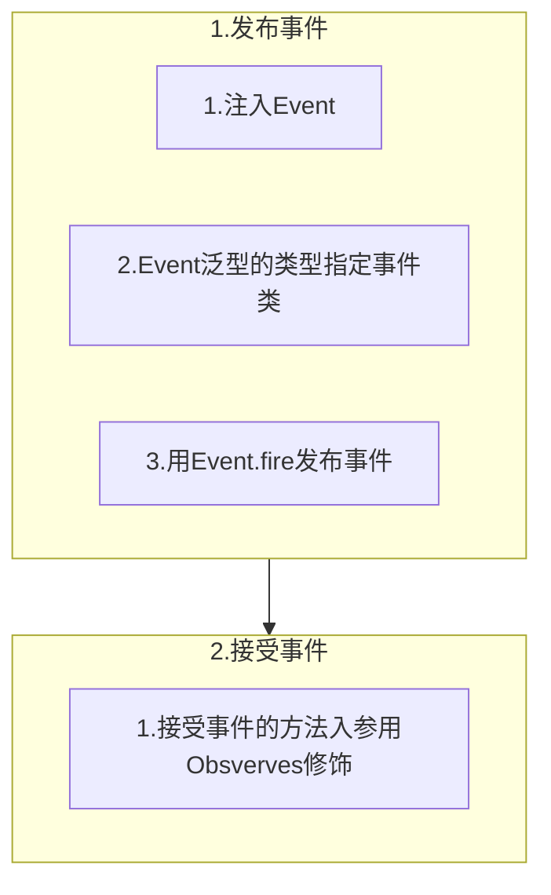
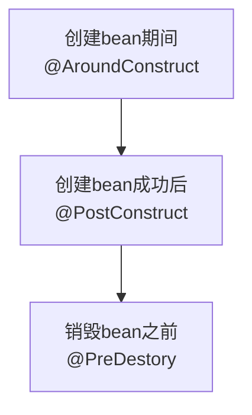
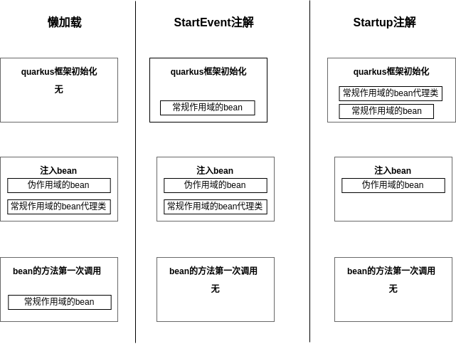

# app-cdi Project

CDI ( Contexts and Dependency Injection 上下文和依赖注入)

> CDI的实现（如quarkus），允许对象做这些事情：
>
> - 绑定到生命周期上下文
> - 注入
> - 与拦截器和装饰器关联
> - 通过触发和观察事件，以松散耦合的方式交互


> 上述场景的对象统称为**bean**，上下文中的 bean 实例称为**上下文实例**，上下文实例可以通过依赖注入服务注入到其他对象中
> **exactly one bean must be assignable to an injection point, otherwise the build fails**
> 0 : UnsatisfiedResolutionException , n(n>1) : AmbiguousResolutionException


## 创建Bean
1. 注解修饰在类上(class-based beans)

   Bean: [ClassAnnotationBean](./src/main/java/org/example/basedi/ClassAnnotationBean.java)  

   endPoint: [ClassAnnotationController](./src/main/java/org/example/basedi/ClassAnnotationController.java)  

2. 注解修饰在方法上 (producer method)

   Bean: [MethodAnnonationBean](./src/main/java/org/example/basedi/MethodAnnonationBean.java)

   endPoint: [MethodAnnotationController](./src/main/java/org/example/basedi/MethodAnnotationController.java)


3. 注解修饰在成员变量上 (producer field)


   Bean: [FieldAnnonationBean](./src/main/java/org/example/basedi/FieldAnnonationBean.java)

   endPoint: [FieldAnnotationController](./src/main/java/org/example/basedi/FieldAnnotationController.java)

4. 扩展组件中的synthetic bean

   这种bean只会在扩展组件中用到，而咱们日常的应用开发不会涉及; 

   synthetic bean的特点是其属性值并不来自它的类、方法、成员变量的处理，而是由扩展组件指定的

## bean的作用域



| 时间点       | 常规作用域                                 | 伪作用域         |
| ------------ | ------------------------------------------ | ---------------- |
| 注入的时候   | 注入的是一个代理类，此时注入的类并未实例化 | 触发类的实例化   |
| 方法首次执行 | 1. 触发类实例化<br>2. 执行常规业务代码     | 执行常规业务代码 |


 > Dependent的特点是每个注入点的bean实例都不同，针对这个特点，quarkus提供了一个特殊能力：bean的实例中可以取得注入点的元数据


## 用注解选择注入bean

1. `LookupIfProperty`，配置项的值符合要求才能使用bean

   ```
   注解LookupIfProperty的作用是检查指定配置项，如果存在且符合要求，才能通过代码获取到此bean
   
   LookupIfProperty并没有决定是否实例化beam，它决定的是能否通过代码取到bean，这个代码就是Instance<T>来注入，并且用Instance.get方法来获取
   ```

2. `LookupUnlessProperty`，配置项的值不符合要求才能使用bean

   ```
   LookupIfProperty和LookupUnlessProperty都有名为lookupIfMissing的属性，意思都一样：指定配置项不存在的时候，就执行注解所修饰的方法
   ```

   

3. `IfBuildProfile`，如果是指定的profile才能使用bean

   ```
   应用在运行时，其profile是固定的，IfBuildProfile检查当前profile是否是指定值，如果是，其修饰的bean就能被业务代码使用
   
   对比官方对LookupIfProperty和IfBuildProfile描述的差别，LookupIfProperty决定了是否能被选择，IfBuildProfile决定了是否在容器中
   ```

   

4. `UnlessBuildProfile`，如果不是指定的profile才能使用bean

5. `IfBuildProperty`，如果构建属性匹配才能使用bean


## 选择注入bean的高级手段
选择bean的手段有以下四种：
1. 修饰符匹配

   ```
   在注入bean的地方，如果有了Qualifier修饰符，可以把@Inject省略不写了
   
   在定义bean的地方，如果没有Qualifier修饰符去修饰bean，quarkus会默认添加Default
   
   在注入bean的地方，如果没有Qualifier修饰符去修饰bean，quarkus会默认添加Default
   ```

2. Named注解的属性匹配

   ```
   Named注解的功能与前面的Qualifier修饰符是一样的，其特殊之处在于通过注解属性来匹配修饰bean和注入bean
   ```

3. 根据优先级选择

   ```
   使用优先级来选择注入是一种简洁的方式，其核心是用Alternative和Priority两个注解修饰所有备选bean，
   然后用Priority的属性值（int型）作为优先级，该值越大代表优先级越高
   
   在注入位置，quarkus会选择优先级最高的bean注入
   
   @Alternative表明这是个可供选择的bean 
   @Priority表明了它的优先级，Priority的属性值用于和其他bean的优先级比较，数字越大优先级越高
   ```

4. 写代码选择

   ```
   在注入bean的位置，如果用Instance<T>来接收注入，就可以拿到T类型的所有bean，然后在代码中随心所欲的使用这些bean
   ```

   


## 拦截器(Interceptor)

### 定义和使用拦截器的操作步骤介绍
1. 定义：新增一个注解（假设名为`A`），要用`@InterceptorBinding`修饰该注解
1. 实现：拦截器A到底要做什么事情，需要在一个类中实现，该类要用两个注解来修饰：`A`和`Interceptor`
1. 使用：用`A`来修饰要拦截器的bean





### 拦截异常

`@AroundInvoke`


### 拦截构造方法

`@AroundConstruct`


### 获取被拦截方法的参数

### 多个拦截器之间传递参数

- 多个拦截器拦截同一个方法是很正常的，他们各司其职，根据优先级按顺序执行; 拦截器之间共享数据的关键是context.getContextData()方法的返回值
- quarkus支持不同拦截器间共享同一个上下文的数据;


### 发布和消费事件

#### 同步事件

- 同步事件是指事件发布后，事件接受者会在同一个线程处理事件，对事件发布者来说，相当于发布之后的代码不会立即执行，要等到事件处理的代码执行完毕后



#### 异步事件

- 为了避免事件消费耗时过长对事件发送的线程造成影响，可以使用异步事件

- 事件发布前后的两个日志是紧紧相连的，这证明发送事件之后不会等待消费，而是立即继续执行发送线程的代码

- 消费事件的日志显示，消费逻辑是在一个新的线程中执行的

- 消费结束后的回调代码中也打印了日志，显示这端逻辑又在一个新的线程中执行，此线程与发送事件、消费事件都不在同一线程


#### 同一种事件类，用在不同的业务场景

- 用Qualifier注解解决 


#### 小优化，不需要注入多个Event实例

- 执行fire方法发送事件前，先执行select方法，入参是AnnotationLiteral的匿名子类，并且**通过泛型指定事件类型**


#### 事件元数据

- 在消费事件时，除了从事件对象中取得业务数据，有时还可能需要用到事件本身的信息，例如类型是Admin还是Normal、Event对象的注入点在哪里等，这些都算是事件的元数据
- `EventMetadata`


### 生命周期回调

- 在bean生命周期的不同阶段，都可以触发自定义代码的执行
- 触发自定义代码执行的具体方式，是用对应的注解去修饰要执行的方法



#### 自定义模式

- 在bean的内部，只能用`@PostConstruct`和`@TrackLifeCycle`，不能用`@AroundConstruct`，只有拦截器才能用`@AroundConstruct`
- 在拦截器中，`@PostConstruct`和`@TrackLifeCycle`修饰的方法必须要有`InvocationContext`类型的入参，但是在bean内部则没有此要求
- `@dispose`注解：实现销毁前自定义操作，dispose是另一种可选方案


### 装饰器（Decorator）

- quarkus也支持装饰器模式，通过注解**@Decorator**和**@Delegate**实现
- `@Priority`属性值越大，越**接近原始类**


### bean读写锁

- `io.quarkus.arc.Lock` 


### bean懒加载

#### 懒加载（*Lazy Instantiation*）

- 常规作用域的bean（例如ApplicationScoped、RequestScoped），在注入时，实例化的是其代理类，而真实类的实例化发生在bean方法被首次调用的时候
- 伪作用域的bean（Dependent和Singleton），在注入时就会实例化

#### 改变懒加载规则的第一种手段

- 让bean尽早实例化的第一种手段，是让bean消费StartupEvent事件，这是quarkus框架启动成功后发出的事件，从时间上来看，此事件的时间比注入bean的时间还要早，这样消费事件的bean就会实例化

####  改变懒加载规则的另一种手段

	- 用`@io.quarkus.runtime.Startup`修饰类
	- `io.quarkus.runtime.Startup`的value属性值，是bean的优先级，这样，多个bean都使用Startup的时候，可以通过value值设置优先级，以此控制实例化顺序（实际上控制的是事件observer的创建顺序）
	- 如果一个类只有Startup注解修饰，而没有设置作用域的时候，quarkus自动将其作用域设置为ApplicationScoped



### 拦截器高级特性

- 属性设置

### 禁用类级别拦截器

- `@NoClassInterceptors`  针对有注解`@AroundInvoke`或`@AroundConstruct`修饰的方法，使他们失效

  

### quarkus简化

- bean注入

```
//将配置文件中名为greeting.message的配置项注入到bean的成员变量greetingMsg中，按照CDI规范的写法如下:
@Inject
@ConfigProperty(name = "greeting.message")
String greetingMsg

//在quarkus框架下可以略去@Inject
@ConfigProperty(name = "greeting.message")
String greetingMsg
```

- bean构造方法

```
//关于bean的构造方法，CDI有两个规定：首先，必须要有无参构造方法，其次，有参数的构造方法需要@Inject注解修饰，实例代码如下所示:
@ApplicationScoped
public class MyCoolService {

  private SimpleProcessor processor;

  MyCoolService() { // dummy constructor needed
  }

  @Inject // constructor injection
  MyCoolService(SimpleProcessor processor) {
    this.processor = processor;
  }
}

//在quarkus框架下，无参构造方法可不写，有参数的构造方法也可以略去@Inject，写成下面这样的效果和上面的代码一模一样
@ApplicationScoped
public class MyCoolService {

  private SimpleProcessor processor;
  
  MyCoolService(SimpleProcessor processor) {
    this.processor = processor;
  }
}
```


- bean生产方法

```
//在CDI规范中，通过方法生产bean的语法如下，可见要同时使用Produces和ApplicationScoped注解修饰返回bean的方法
class Producers {
  
  @Produces
  @ApplicationScoped
  MyService produceServ
    ice() {
    return new MyService(coolProperty);
  }
}
//在quarkus框架下可以略去@Produces，写成下面这样的效果和上面的代码一模一样
class Producers {

  @ApplicationScoped
  MyService produceServ
    ice() {
    return new MyService(coolProperty);
  }
}
```

### 避免不必要的多次实例化

- `@WithCaching` 如果bean的作用域必须是`@Dependent`，又希望多次Instance#get返回的是同一个bean实例, 用`@WithCaching`注解修饰Instance即可。


